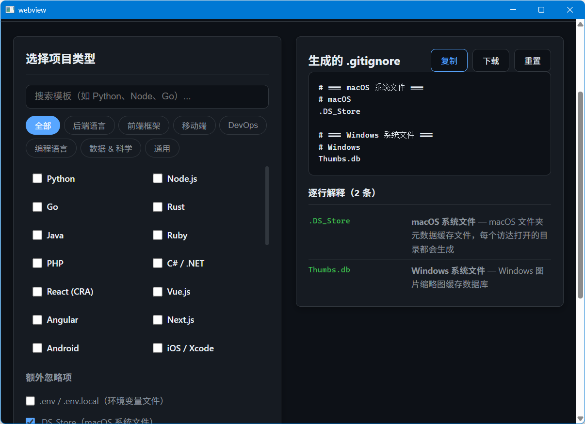

# .gitignore Wizard

> 交互式 .gitignore 生成器 — 点选你的项目类型，一键生成 .gitignore，逐行解释为什么忽略。

---

## 功能

| 功能 | 说明 |
|------|------|
| **点选模板** | 30+ 内置模板，覆盖 Python / Node / Go / Rust / Java / React / Vue / Docker |
| **逐行解释** | 每一行忽略规则都告诉你为什么 |
| **实时搜索** | 按语言/框架名搜索，快速定位 |
| **一键复制** | 点击即复制到剪贴板 |
| **下载文件** | 直接下载 .gitignore 文件 |
| **额外选项** | 勾选 .env / .DS_Store / Thumbs.db / IDE 配置等通用忽略项 |
| **自动保存** | 你的选择保存在浏览器，下次打开自动恢复 |
| **响应式** | 桌面和移动端都能用 |

## 安装方法

本脚本的运行环境、依赖组件均依赖"不忙脚本盒子"，建议仅通过盒子安装和使用本脚本。

> 前置条件：安装好 [不忙脚本盒子](https://www.bm-box.cn)

* 打开盒子 → **脚本市场** → 搜索 **「.gitignore生成」**
* 点击「安装」

---

## 使用方式

* 直接启动
  * 在盒子里点击脚本卡片
  * 弹出.gitignore生成窗口

* 右键启动 / 快捷键启动
  * 在文件管理器空白处右键 → 选择「.gitignore生成」，或按下为该脚本设置的全局快捷键

## 鸣谢
本项目 Fork 自 [foweh/gitignore-wizard](https://github.com/foweh/gitignore-wizard)，感谢原作者的开源与付出。
